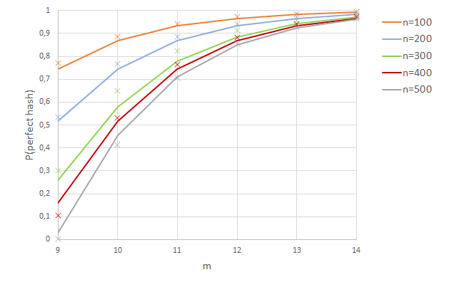

# On candidate Boost.OpenMethod's perfect hashing

Given a collection of `n` types `Ti`, candidate Boost.OpenMethod hashes their so-called
`type_id`s (the addresses in memory of the types' associated `std::type_info` objects) using
the utility [`fast_perfect_hash`](https://jll63.github.io/Boost.OpenMethod/#virtual_ptr_fast_perfect_hash)
class. The hashing formula is simply

```cpp
C*x>>64-m // in 64-bit mode
```

where `x` is a `type_id`, `C` is a random 64-bit number, and the number of buckets is 2<sup>`m`</sup>.
`fast_perfect_hash` selects the minimum `m` able to hold `n` elements and tries up to 100,000 random values
for `C` till one of them happens to produce a perfect (no-collision) hash function. If none is found,
`m` is increased by 1 (the number of buckets is doubled), a viable `C` is searched again, and so on.

This brute-force approach works very well, but there's an apparent contradiction: an arbitrary
function $$f(x)$$ mapping $$n$$ pre-selected elements into $$2^m$$ buckets has a combinatorial probability
of being a perfect hash function equal to

$$P(n,m)=\frac{\left(2^m\right)!}{2^{mn}\left(2^m-n\right)!}$$

(see [this presentation](https://github.com/joaquintides/usingstdcpp2024) for details);
if, say, $$n=100$$ and $$m=7$$, then $$P(n,m)=2.4\times 10^{-25}$$, so it is
virtually impossible to hit a perfect hash function by chance, yet `fast_perfect_hash`
manages this without problem. How come? The answer is that the input `type_id`s are far from
scattered in their 64-bit number space. Let us analyze this formally.

We want to the estimate the probability that the function

$$h(x)= \left(Cx \bmod 2^{64}\right)\texttt{ >> } \left(64-m\right) = \left\lfloor\frac{Cx \bmod 2^{64}}{2^{64-m}}\right\rfloor$$

is injective (i.e. a perfect hash function) for a randomly chosen $$0\le C<2^{64}$$ and $$x$$ in a small range $$[a,a+n)$$.
$$h(x)$$ function multiplies its argument by $$C$$ (modulo $$2^{64}$$) and takes the $$m$$ most signficant bits of the result.
An obvious necessary condition for injectivity is that $$n\le 2^m$$, so we will assume this for the remainder
of our discussion.

It is trivial to see that $$h(x)$$ can be rewritten as:

$$h(x)=\left\lfloor\frac{Cx}{B}\right\rfloor \bmod 2^m,$$

with $$B=2^{64-m}$$. If we decompose $$C$$ as $$C_qB+C_r$$, then

$$h(x) = \left(C_qx+\left\lfloor\frac{C_rx}{B}\right\rfloor\right)\bmod 2^m,$$

and, listing out the elements in  $$[a,a+n)$$ in the form

$$x_i=a+i, i=0,1,...,n-1,$$

we have

$$ h_i=\left(C_qa+C_qi+\left\lfloor\frac{C_r(a+i)}{B}\right\rfloor\right)\bmod 2^m.$$

The constant term $$C_qa$$ does not affect injectivity, so we can study the sequence

$$h'_i=\left(C_qi+\left\lfloor\frac{C_r(a+i)}{B}\right\rfloor\right)\bmod 2^m$$

and disregard the small-probability case $$C_q=0$$. Now, ignore for the moment being the
$$\left\lfloor\frac{C_r(a+i)}{B}\right\rfloor$$ term; the period of 

$$h''_i=C_qi\bmod 2^m$$

is

$$T=\frac{2^m}{\gcd\left(C_q,2^m\right)}=\frac{2^m}{2^{v_2(C_q)}},$$

where $$v_2(C_q)$$ is the exponent of the maximum power of 2 dividing $$C_q$$.
So, the values $$h''_i$$ for $$i=0,1,...,n-1$$ are all distinct if $$T\ge n$$
or, equivalently, $$v_2(C_q)\le m-\left\lceil \log_2 n \right\rceil$$, that is,
at least one of the 
$$m-\left\lceil \log_2 n\right\rceil +1$$ least significant bits of $$C_q$$ is nonzero, which happens with probability

$$P(T\ge n)=1-0.5^{m-\left\lceil \log_2 n\right\rceil+1}=1-2^{\left\lceil \log_2 n\right\rceil-m-1}.$$

This is not yet our required probability estimation, as we have to take into accout the
perturbation introduced by $$\left\lfloor\frac{C_r(a+i)}{B}\right\rfloor$$.
We have failed to find a way to deal with this analytically, so the following
introduces a correction factor found empirically:

$$P(h(x)\text{ is injective}) \approxeq \left(1-2^{\left\lceil \log_2 n\right\rceil-m-1}\right) \left( 1- \frac{n}{2^m}\right)^{0.75}.$$

The figure plots this function for several choices of $$n$$ and $$m$$ (solid lines)
alongside actual values obtained via [numerical simulation](simulation.cpp) (crosses):



Fit with actual data is somewhat poor for lower values of $$m$$, but in any case
we have shown that the probability of finding a perfect hash function in the
proposed setting is many orders of magnitude higher than for the general combinatorial
case. Going back to candidate Boost.OpenMethod, in a typical program `std::type_info`s
are packed together in a contiguous memory segment, although there are minor
differences with the theoretical scenario analyzed:

* Input `type_id`s are not necessarily contiguous (there may be types in between).
The analysis holds if only we consider that the probability of finding a perfect hash
function is _higher_ than if we consider the entire range from the lowest to the highest
`type_id` (that is, including non-used inputs). 
* Considered as numerical values, addresses are not of the form $$a+i$$, $$i=0,1,....,n-1$$,
but rather follow a distribution $$a+di$$, where $$d$$ is `sizeof(std::type_info)`.
This does not affect the analysis at all, as a valid constant $$C$$ for the former case
produces a valid constant $$Cd$$ for the latter.

So, the analysis is applicable to Boost.OpenMethod and explains its seemingly unreasonable
efficiency at finding perfect hash functions for type IDs.
